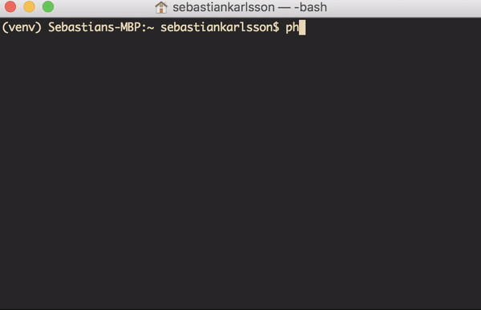

# PHPDoc
> PHP function documentation in your __commandline__!

## Setup

    python setup.py install

## Usage

    phpdoc <function_name>

> This will print out the function with the _arguments in the correct order_ ;)
